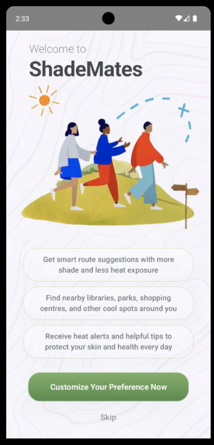
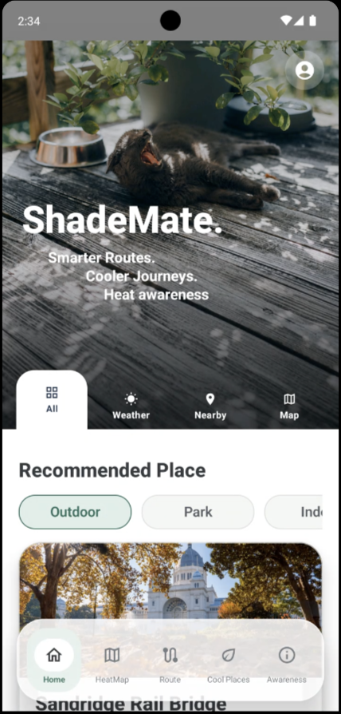
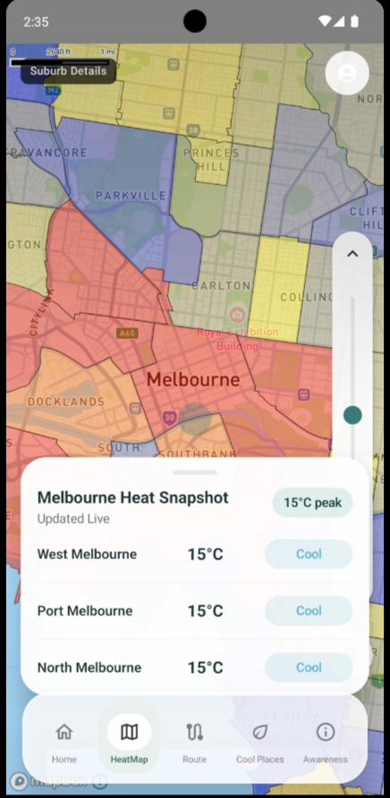
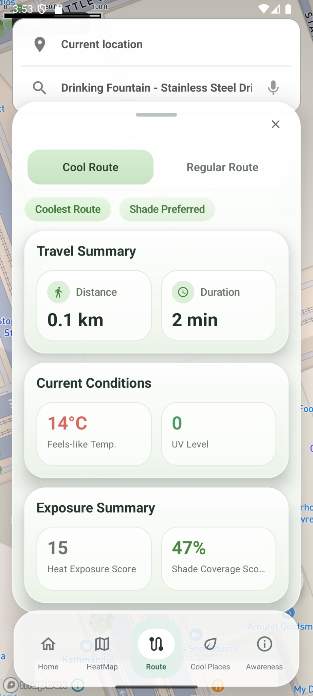
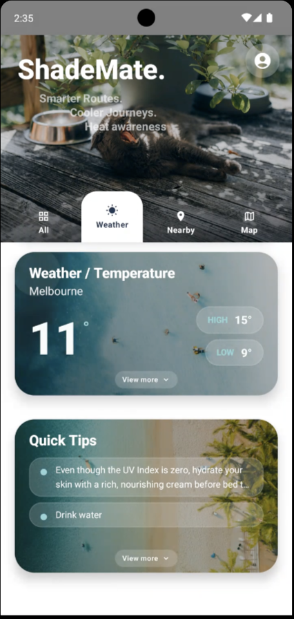
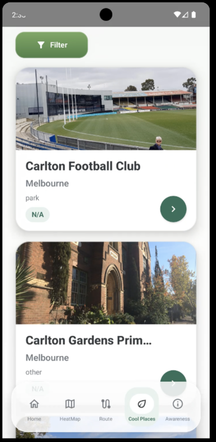
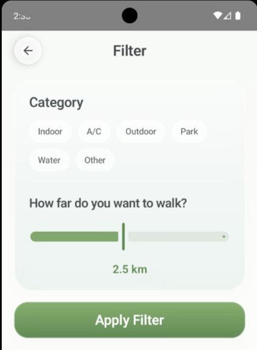
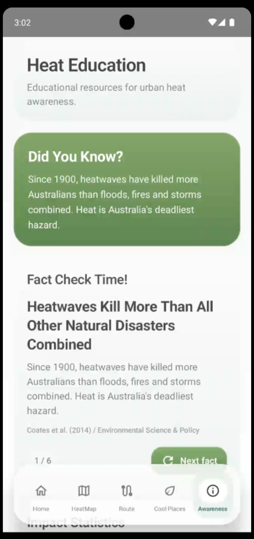
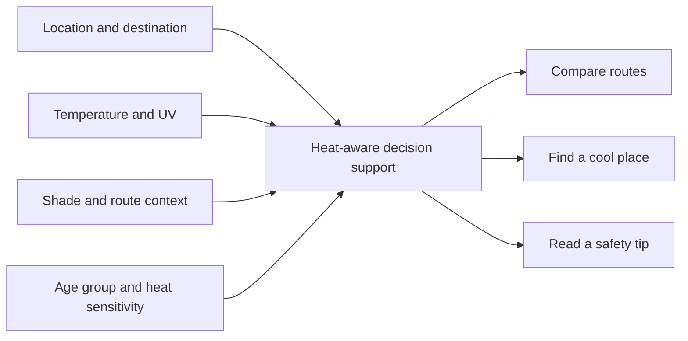
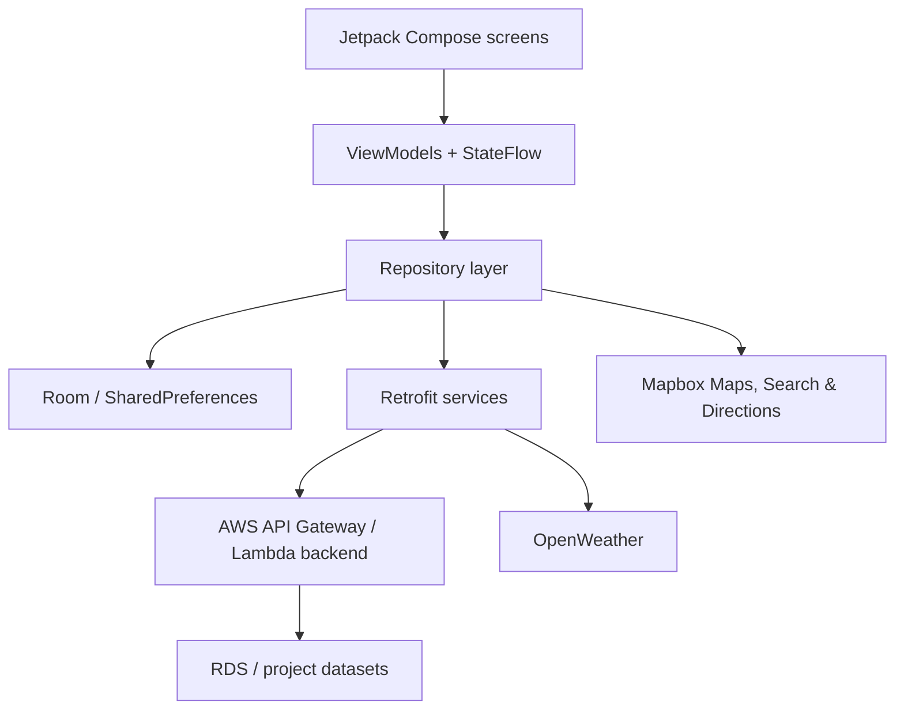

# ShadeMates

<p align="center">
  <strong>Smarter routes. Cooler journeys.</strong><br>
  A heat-aware Android experience for safer walking decisions in Melbourne.
</p>

<p align="center">
  <a href="https://eportfolio.monash.edu/view/view.php?t=f5ce7016aa019361fce9">Project e-portfolio</a>
  ·
  <a href="docs/PRODUCT.md">Product case study</a>
  ·
  <a href="docs/DESIGN-JOURNEY.md">Design journey</a>
  ·
  <a href="docs/ARCHITECTURE.md">Architecture</a>
</p>

> **Public showcase edition.** This repository is a curated, security-sanitised snapshot of a collaborative Monash University FIT5120 capstone project. It preserves the original Android implementation while adding the product story, final screenshots, design rationale, architecture, testing notes, and attribution needed for portfolio review. The team's original private repository remains unchanged.

## The product

ShadeMates helps people compare outdoor conditions before walking through Melbourne. Instead of presenting weather as a city-wide number, the experience brings together local heat context, UV risk, shade coverage, route options, nearby places to cool down, and concise safety education.

The final Iteration 3 prototype contains five main areas:

- **Home** - local weather and UV context, heat/shade indicators, personalised quick tips, nearby places, and a heat-map preview.
- **Heat Map** - an interactive Mapbox view with colour-coded heat areas and a Melbourne heat snapshot.
- **Cool Route** - destination search, route alternatives, travel conditions, heat exposure, and shade coverage.
- **Cool Places** - nearby parks, indoor venues, water access, and category/distance filters.
- **Awareness** - short, source-aware heat and UV education designed for quick reading.

### Final product gallery

The images below are from the final handover build, not the earlier prototype shown on the school-hosted e-portfolio.

<table>
  <tr>
    <td align="center"><br><sub>Onboarding</sub></td>
    <td align="center"><br><sub>Home</sub></td>
    <td align="center"><br><sub>Heat map</sub></td>
    <td align="center"><br><sub>Cool route</sub></td>
  </tr>
  <tr>
    <td align="center"><br><sub>Weather & tips</sub></td>
    <td align="center"><br><sub>Cool places</sub></td>
    <td align="center"><br><sub>Filters</sub></td>
    <td align="center"><br><sub>Awareness</sub></td>
  </tr>
</table>

## From problem to decision support

Extreme heat is a serious public-health and liveability challenge. Standard mapping and weather tools answer *where am I going?* and *what is the temperature?* ShadeMates explores a more useful question:

> **Given the current conditions and my sensitivity to heat, which journey is likely to expose me to less heat and more shade?**

The product concept was shaped around commuters and other heat-vulnerable residents who need practical choices rather than another dashboard. The final flow turns several inputs into a small set of actions:



The [design journey](docs/DESIGN-JOURNEY.md) shows how early persona work, wireframes, iteration feedback, and scope decisions evolved into the final Android experience.

## Architecture

The Android client uses a layered Compose architecture. Screens observe ViewModel state; repositories isolate UI code from network and local-storage details; Retrofit, Room, Mapbox, OpenWeather, and the project backend provide the underlying capabilities.



See [Architecture](docs/ARCHITECTURE.md) for component boundaries, data flows, graceful-degradation behaviour, and the public-release configuration model.

## Technology

- Kotlin 2.0.21 and Android SDK 36
- Jetpack Compose and Material 3
- ViewModel, coroutines, and StateFlow
- Retrofit, Gson, and repository/DTO mapping
- Room for recent local weather data
- Mapbox Maps, Search, Directions, and Turf
- OpenWeather-backed environmental context
- AWS API Gateway/Lambda-backed project APIs

## Project journey

| Iteration | Product focus | Outcome |
| --- | --- | --- |
| 1 | Problem framing, persona, heat-map concept, first wireframes | Established a heat-aware mobility proposition |
| 2 | Map usability, cooler routes, current-location context, nearby cool places | Moved from information display to trip support |
| 3 | Personalisation, UV context, exposure duration, shade coverage, education | Delivered the final integrated handover prototype |

The proposal and handover materials have been condensed into readable, privacy-safe Markdown:

| Document | What it covers |
| --- | --- |
| [Product case study](docs/PRODUCT.md) | Problem, audience, solution, value, scope, roadmap |
| [Design journey](docs/DESIGN-JOURNEY.md) | Persona, empathy map, early wireframes, iteration decisions |
| [Architecture](docs/ARCHITECTURE.md) | Client layers, services, data handling, failure states |
| [Testing](docs/TESTING.md) | Validation approach, feedback themes, checks, known gaps |
| [Setup](docs/SETUP.md) | Android prerequisites, credentials, build and test commands |
| [Security](docs/SECURITY.md) | Public-release hardening, privacy model, residual risks |
| [Attribution](docs/ATTRIBUTION.md) | Team credit, coursework context, datasets and services |

## Run locally

This repository contains the Android client. Mapbox dependencies and runtime services require your own credentials, and the original course backend is not bundled or guaranteed to remain available.

1. Install Android Studio, Android SDK 36, and JDK 11.
2. Add the required values to your **user-level** Gradle properties file, not this repository:

   ```properties
   MAPBOX_DOWNLOADS_TOKEN=your_secret_downloads_token
   MAPBOX_ACCESS_TOKEN=your_public_runtime_token
   OPENWEATHER_API_KEY=your_openweather_key
   UV_TIPS_API_KEY=your_backend_api_key
   BACKEND_BASE_URL=https://your-backend.example.com/
   ```

3. Sync the project and run the `app` configuration, or build from PowerShell:

   ```powershell
   .\gradlew.bat assembleDebug
   .\gradlew.bat testDebugUnitTest
   ```

Full configuration details and Windows paths are in [Setup](docs/SETUP.md).

## Scope and limitations

- This is a research/coursework prototype, not a medical device, emergency service, or source of clinical advice.
- Coverage and data assumptions focus on Melbourne CBD and selected Melbourne areas.
- Live behaviour depends on third-party services, API quotas, credential configuration, and backend availability.
- Weather, UV, shade, and exposure values are decision-support signals, not guarantees of personal safety.
- Full offline operation and production-grade monitoring remain future work.
- No APK is published here because the original handover build contained environment-specific credentials; build from source with your own configuration.

## Team and ownership

ShadeMates was created by the **NightOwlz / HelloWorld Inc. TP41 team** for Monash University FIT5120, Semester 1 2026:

Jiahui Qing · Qi Yu · Raden M. Musa Saleh · Ruwang Lin · Xinyu Fan · Yosar Fatahillah

This public showcase is maintained by **Ruwang Lin**. It does not present the work as a solo project; individual and team contributions remain credited to their respective authors. The linked [school e-portfolio](https://eportfolio.monash.edu/view/view.php?t=f5ce7016aa019361fce9) provides additional historical context but contains earlier product imagery.

## Use and licensing

No open-source licence is granted by this showcase repository. The code, documentation, and design artefacts remain the work of their respective contributors and are made visible for portfolio and evaluation purposes. Please contact the contributors before reuse, redistribution, or derivative work.
