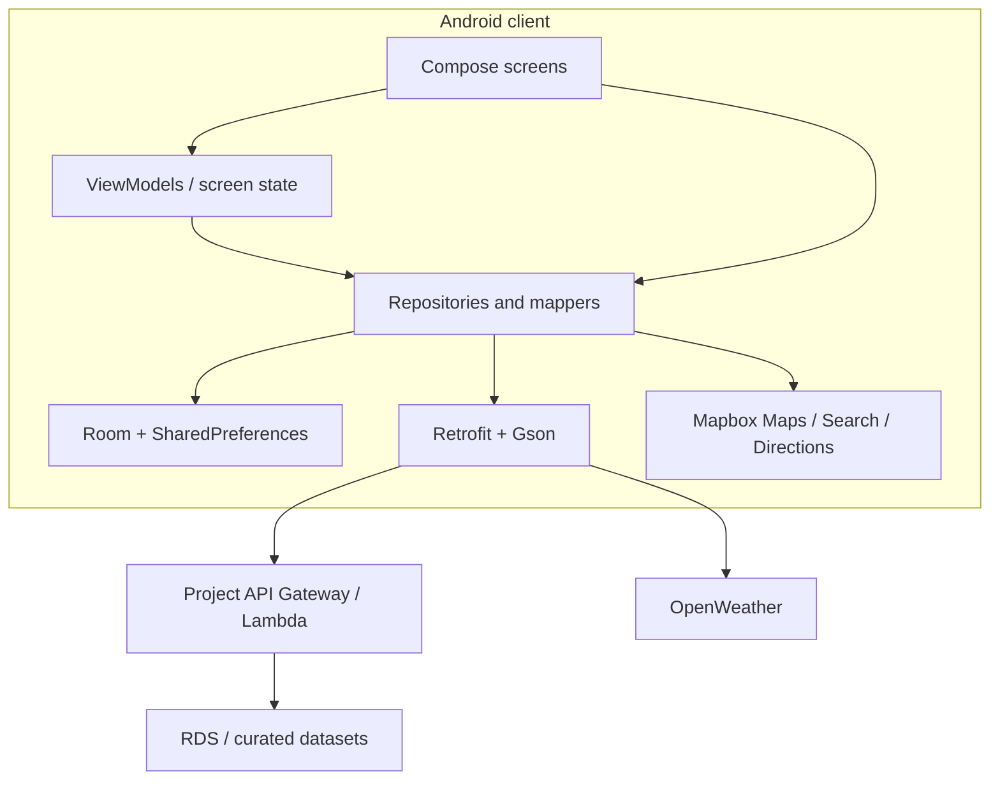

# Architecture

## Scope

This public repository contains the native Android client. The course backend, cloud infrastructure, databases, model-training scripts, and operational credentials are not included.

## Client architecture



The codebase follows a pragmatic layered structure:

```text
app/src/main/java/com/example/a5120_shademate/
├── MainActivity.kt
├── data/
│   ├── api/
│   ├── local/
│   └── repositories and mock/fallback sources
├── model/
└── ui/
    ├── components/
    ├── navigation/
    ├── screens/
    ├── theme/
    └── viewmodel/
```

## Responsibility map

| Area | Main responsibility | Representative files |
| --- | --- | --- |
| App shell | Token initialisation and launch flow | `MainActivity.kt` |
| Navigation | Five-tab application structure | `ui/navigation/ShadeMateApp.kt` |
| Home | Overview cards, tips, recommendations, map preview | `HomeScreen.kt`, `HomeViewModel.kt` |
| Heat map | Map rendering, area state, overlays, heat snapshot | `InteractiveMapScreen.kt`, map ViewModels |
| Route | Search, Mapbox route geometry, comparison and exposure summary | `RouteScreen.kt`, `WalkingRouteRepository.kt` |
| Cool places | API mapping, fallback content, filtering and details | `CoolPlacesScreen.kt`, `CoolPlaceDetailScreen.kt`, `ApiCoolPlaceRepository.kt` |
| Awareness | Education content and source presentation | `EducationScreen.kt`, `ApiHeatRepository.kt` |
| Local persistence | Recent suburb weather | `AppDatabase.kt`, `WeatherDao.kt`, `SuburbWeather.kt` |
| Shared API client | Backend Retrofit configuration | `AppApiClient.kt` |

## Data flows

### Home overview

1. The screen requests current-location overview state.
2. `HomeViewModel` coordinates repositories.
3. Weather/UV values are fetched or resolved from available data.
4. Recent suburb weather can be cached with Room.
5. Saved age-group and heat-sensitivity inputs are used when requesting a personalised tip.
6. UI state represents loading, content, and failure paths.

### Heat map

1. Mapbox renders the base map and custom feature layers.
2. Heat-area models and weather enrichment determine displayed state.
3. Tapping an area updates the selected detail.
4. The screen keeps an explicit error/fallback path when map or data services fail.

### Cool route

1. Mapbox Search resolves origin/destination suggestions.
2. Mapbox Directions returns walking geometry and alternatives.
3. The repository assembles distance, duration, weather, UV, and shade-related context.
4. The UI presents a recommended “cool” option beside a regular route for comparison.

The handover design also describes a backend route-exposure pipeline that enriches road segments with tree cover, temperature, UV, and street/building geometry. The training pipeline and cloud routing implementation are outside this client repository, so the public showcase does not claim they are reproducible from this code alone.

### Cool places and awareness

Backend records are mapped into UI-specific models. Cool places have a local sample fallback when the endpoint or mapper fails. Education content uses loading, empty, and error states rather than assuming the service is always available.

## External dependencies

| Dependency | Client capability | Failure impact |
| --- | --- | --- |
| Mapbox Maps | Base map and overlays | Map views cannot render normally |
| Mapbox Search | Place autocomplete | Destination entry is degraded |
| Mapbox Directions | Walking geometry and route alternatives | Route comparison is unavailable |
| OpenWeather | Weather and UV context | Values may be blank, stale, or fall back |
| Project backend | Cool places, education, overview/tips data | Repository fallback/error states are used |
| Room | Recent local weather cache | Weak-network resilience is reduced |

## Graceful degradation

The final client includes several resilience patterns:

- cool-place sample data if backend mapping/fetch fails
- Room-backed recent weather data
- best-available route summary when one scoring input is missing
- explicit loading, empty, and error UI states
- user-facing failure messages instead of exposing stack traces

These patterns improve prototype usability but do not constitute a full offline mode.

## Configuration model

The private course snapshot contained environment credentials in tracked source. The public showcase removes them and injects configuration at build time:

| Gradle property | Generated target |
| --- | --- |
| `MAPBOX_ACCESS_TOKEN` | Android string resource |
| `OPENWEATHER_API_KEY` | `BuildConfig.OPENWEATHER_API_KEY` |
| `UV_TIPS_API_KEY` | `BuildConfig.UV_TIPS_API_KEY` |
| `BACKEND_BASE_URL` | `BuildConfig.BACKEND_BASE_URL` |
| `MAPBOX_DOWNLOADS_TOKEN` | Mapbox Maven credentials in `settings.gradle.kts` |

All values belong in the developer's user-level Gradle properties. See [Setup](SETUP.md).

## Data and privacy boundaries

- Age group and heat-sensitivity preferences are stored on device.
- Relevant values may be transmitted for a personalised request.
- The final design does not require a persistent server-side user profile.
- Location is needed for maps, route search, and nearby recommendations.
- The public repository contains no live keys, student IDs, internal contact matrix, APK, or private project archive.

## Production gaps

Before a real deployment, the team or sponsor would need to:

- keep upstream service secrets on the server wherever possible
- add authenticated and authorised backend access
- configure key/package restrictions and rotation
- add schema contracts and integration tests
- add observability, health checks, and alerting
- validate route/exposure outputs against field data
- define retention, consent, deletion, and incident-response policies
- complete accessibility and security testing against a release build
