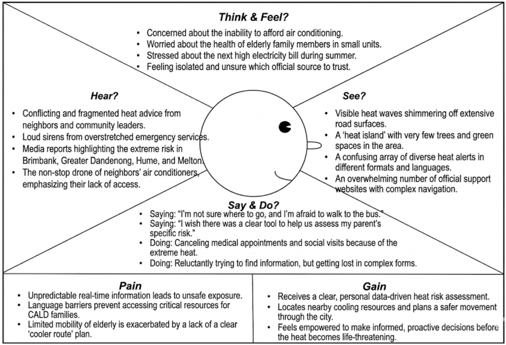
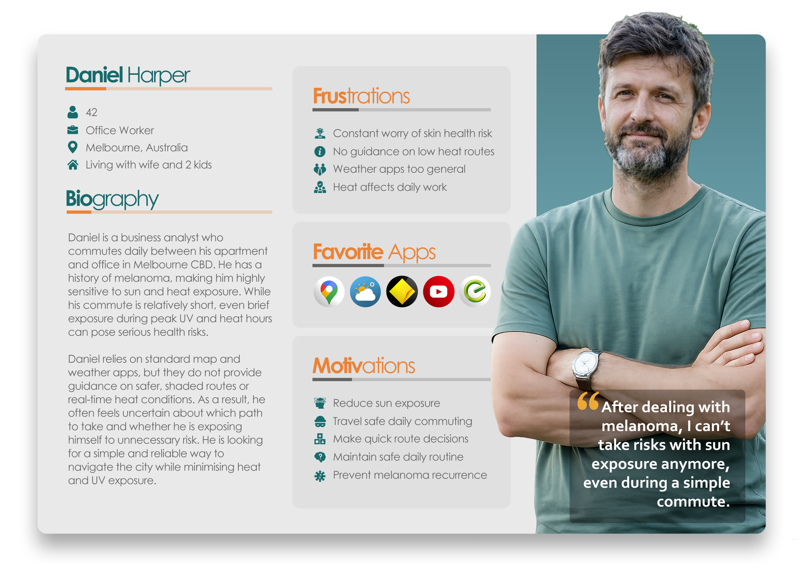
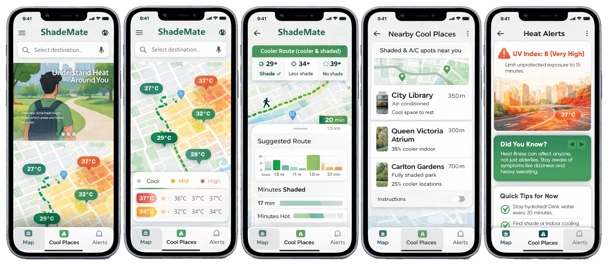
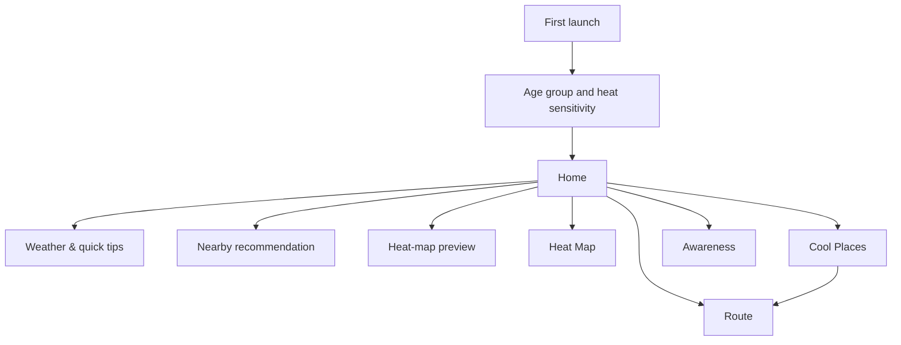

# Design journey

ShadeMates evolved through three iterations: from a broad urban-heat concept, to map and trip support, to a more integrated product with personalisation, exposure context, and education.

## 1. Frame the human problem

The team used an empathy map to explore what a heat-vulnerable resident might see, hear, think, and do during extreme conditions. The exercise highlighted fragmented advice, uncertainty about trustworthy sources, mobility constraints, and the need for a clear next action.

The resulting product direction was not simply “show a hotter map.” It was to connect information to a route, a place to pause, or an immediate safety action.

## 2. Focus the audience

The target audience was refined from a broad outdoor-worker concept to an illustrative daily commuter with heightened sensitivity to sun and heat. “Daniel Harper” is a fictional design persona, not a real user or medical case.

The persona helped the team prioritise:

- short, repeatable commuter journeys
- rapid comparison rather than expert analysis
- shade and UV alongside temperature
- low-friction destination search
- clear actions under time pressure

## 3. Explore the interaction model

Iteration 1 wireframes tested a three-part proposition: understand nearby heat, find a cooler route, and discover cool places. The concepts were visually polished, but several elements were still speculative and iOS-styled.

These wireframes are included as design history. They are not screenshots of the final Android build.

## 4. Learn through iteration

### Iteration 1 - establish the proposition

The first iteration connected a heat-map concept with walking decisions and nearby places. It established the core visual language and revealed that a dense map alone would not provide enough guidance.

### Iteration 2 - make the map useful for a trip

The second iteration added and refined:

- simpler suburb-level heat visualisation
- clearer pan/zoom behaviour
- current-location context
- destination search and cooler-route comparison
- nearby cool places

Usability feedback highlighted irrelevant destination suggestions and unclear place categorisation. The later interface narrowed the experience toward Melbourne and introduced a more explicit category/distance filter.

### Iteration 3 - connect risk context to action

The final proposal prioritised:

- personalised heat guidance
- UV index and exposure duration
- shade coverage and heat exposure
- clearer safety actions
- heat-awareness education

The final Android build brought those elements into a five-tab navigation model and added first-launch preferences.

## 5. Concept-to-product changes

| Early concept | Final product decision | Why it changed |
| --- | --- | --- |
| iOS-style three-tab prototype | Native Android, five bottom-navigation areas | Match the implementation platform and make the product scope explicit |
| “Cooler route” as a simple map line | Route comparison with travel and exposure summaries | Explain *why* a route is recommended |
| Alerts as a primary tab | Awareness plus contextual tips | Avoid implying production-grade emergency notification capability |
| Broad heat-vulnerable audience | Commuter-led persona with configurable sensitivity | Give prioritisation decisions a concrete use case |
| General nearby-place list | Category and walking-distance filters | Address clarity and relevance feedback |
| Static heat information | Heat map, weather/UV context, shade, and exposure indicators | Turn conditions into a more complete decision |

## 6. Final information architecture

## 7. Visual direction

The final UI uses soft greens, white cards, rounded surfaces, and photographic context. Green is used as the primary action and “cooler/shaded” signal, while red/orange is reserved for heat and risk. Large cards and bottom navigation keep primary actions reachable and reduce text density.

The visual system is deliberately calm: the experience should support a decision without making a health-adjacent product feel alarmist.

## 8. Open design questions

A production round of design work should test:

- colour interpretation for users with colour-vision differences
- font scaling and TalkBack navigation
- whether heat, shade, and exposure scores are understood without explanation
- how users respond when live data is stale or missing
- whether personalisation questions feel proportionate and trustworthy
- whether route trade-offs are clear when the cooler route is longer
