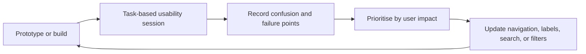

# Testing and validation

## What was evaluated

Testing during the capstone focused primarily on task-based usability across iterations, supported by build checks and a small number of local/instrumented Android tests.

The internal project archive contains usability recordings and iteration reports. They are not published here because they include participant imagery, voices, names, and course-internal material.

## Iteration feedback loop



### Feedback themes reflected in the final UI

| Observation | Design/implementation response |
| --- | --- |
| Heat visualisations could be difficult to navigate | Simpler map framing, pan/zoom controls, map preview, and a compact heat snapshot |
| Destination suggestions could be geographically irrelevant | Greater emphasis on Melbourne-context search and nearby results |
| Cool-place categories lacked clarity | Dedicated category chips plus walking-distance control |
| Environmental data did not always imply an action | Quick tips, route comparison, exposure summary, and awareness content |
| A general heat score did not cover sun risk | UV context, exposure duration, and shade coverage in Iteration 3 |

The supplied Iteration 3 test report records two specific findings: cool-place categorisation clarity and irrelevant distant destination suggestions. The final screenshots show the revised filter experience. The report itself was marked “on-going,” so this repository does not present the coursework evidence as a completed production validation study.

## Automated checks in this repository

The client currently contains:

- two focused unit tests for cool-place distance mapping
- the Android template arithmetic smoke test
- the Android template package-name instrumented test

Run JVM tests:

```powershell
.\gradlew.bat testDebugUnitTest
```

Run instrumented tests with an emulator or device:

```powershell
.\gradlew.bat connectedAndroidTest
```

Build the debug APK:

```powershell
.\gradlew.bat assembleDebug
```

## Manual smoke test

1. Complete or skip onboarding.
2. Confirm Home loads without a crash.
3. Open Weather and check that values/timestamps are plausible.
4. Open Heat Map and verify the map, coloured areas, and detail panel.
5. Search for a Melbourne destination in Route.
6. Confirm a route renders and its summary is readable.
7. Open Cool Places, change category/distance filters, and open a detail.
8. Open Awareness and confirm facts/source labels appear.
9. Disable network access and verify that failure/fallback states remain usable.
10. Re-enable network access and confirm the app can recover without reinstalling.

## Quality risks and missing coverage

This is an honest portfolio snapshot, so the following gaps remain visible:

- limited automated coverage for ViewModels, repositories, and error paths
- no committed contract tests for the project backend
- no screenshot/regression suite
- no automated accessibility suite
- no performance benchmark for map rendering
- no reproducible public test dataset for route/exposure accuracy
- no public evidence of a full release-candidate penetration test

## Recommended next test investment

1. Add repository tests with mocked Retrofit responses.
2. Add StateFlow/ViewModel tests for loading, content, empty, and failure states.
3. Add Compose UI tests for the five primary journeys.
4. Add a fake backend for deterministic public demos.
5. Add accessibility checks for content descriptions, contrast, focus order, and font scaling.
6. Add field validation for route shade/exposure outputs.
7. Run a consented usability study with target users and report participant count, tasks, success rate, and limitations.
